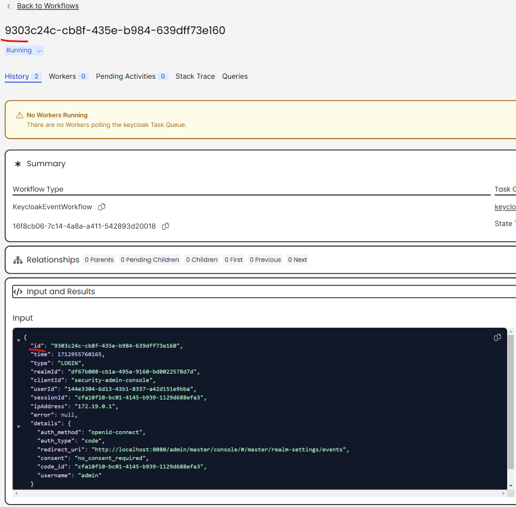

# Keycloak Event Listener for Temporal

[](https://github.com/InfinityFlowApp/keycloak-event-listener-temporal/actions?query=branch%3Amain)
[](https://github.com/InfinityFlowApp/keycloak-event-listener-temporal/releases)
[](https://github.com/InfinityFlowApp/keycloak-event-listener-temporal?tab=Apache-2.0-1-ov-file#readme)

[](https://discord.gg/SqpBQwA3)

This Keycloak SPI Event Listener integrates with Temporal Server, allowing you to publish events to it.

 

## Example Event

For instance, this is how an updated realm event triggered by an administrator might look:

- Task Queue: keycloak
- Namespace: default
- JSON:

```json
{
    "id": "de158ae0-07d4-4581-b244-c85eee292c8c",
    "time": 1712956881563,
    "realmId": "40c965b1-ea85-4a21-85ee-0d6c86771279",
    "authDetails": {
      "realmId": "40c965b1-ea85-4a21-85ee-0d6c86771279",
      "clientId": "a6ca059f-9726-483e-95e5-b1c0965aaf32",
      "userId": "9548dde8-7089-4210-86f3-f0e03a215c01",
      "ipAddress": null
    },
    "resourceType": "REALM",
    "operationType": "UPDATE",
    "resourcePath": "events/config",
    "representation": null,
    "error": null
}
```

## Installation

To get started:

1. [Download](https://github.com/InfinityFlowApp/keycloak-event-listener-temporal/releases) or build from source.
2. Copy the JAR file into your Keycloak installation.
3. Configure as described below.
4. Restart the Keycloak server.
5. Enable logging in the Keycloak UI by adding `temporal`.


## Configuration

You can configure the listener using one of the following methods:


### Option 1: Command Parameters

Use the following command-line parameters:

| Parameter                                                           |
| ------------------------------------------------------------------- |
| --spi-events-listener-temporal-server=temporal:7233                 |
| --spi-events-listener-temporal-namespace=default                    |
| --spi-events-listener-temporal-task-queue=keycloak                  |
| --spi-events-listener-temporal-mtls-cert-file=/etc/client-cert.crt  |
| --spi-events-listener-temporal-mtls-key-file=/etc/client-cert.key   |


### Option 2: Environment Variables

Alternatively, you can set these environmental variables:

| Variable                                        | Value                |
| ----------------------------------------------- | -------------------- |
| KC_SPI_EVENTS_LISTENER_TEMPORAL_SERVER          | temporal:7233        |
| KC_SPI_EVENTS_LISTENER_TEMPORAL_NAMESPACE       | default              |
| KC_SPI_EVENTS_LISTENER_TEMPORAL_TASK_QUEUE      | keycloak             |
| KC_SPI_EVENTS_LISTENER_TEMPORAL_MTLS_CERT_FILE  | /etc/client-cert.crt |
| KC_SPI_EVENTS_LISTENER_TEMPORAL_MTLS_KEY_FILE   | /etc/client-cert.key |

# License
This project is licensed under the Apache License 2.0 - see the [LICENSE](LICENSE) file for details.
